# 01. ERC20 Token

这一讲，我们将介绍以太坊上的`ERC20`代币标准，并发行自己的测试代币。
你将学习到：

- 如何使用 [OpenZeppelin](https://www.openzeppelin.com/contracts) 和 [Remix](https://remix.ethereum.org/) 编写智能合约。
- 如何使用 [MetaMask](https://metamask.io/) 钱包。获取以太坊 `Goerli` 测试网测试代币并在链上转账,mint Token 等交互。
- 如果使用 [Etherscan](https://etherscan.io/) 查看钱包在链上的交互信息。

## ERC20

`ERC20`是以太坊上的代币标准，来自 2015 年 11 月 V 神参与的[`EIP20`](https://eips.ethereum.org/EIPS/eip-20)。它实现了代币转账的基本逻辑：

- 账户余额
- 转账
- 授权转账
- 代币总供给
- 代币信息（可选）：名称，代号，小数位数

## OpenZeppelin

`OpenZeppelin`是一个以太坊智能合约开发框架，它提供了经过测试和验证的合约组件和工具，可帮助开发人员构建安全、可靠的智能合约。使用`OpenZeppelin`的库可以节省时间和精力，同时提供了详细的[文档和示例](https://docs.openzeppelin.com/contracts/4.x/erc20)。

## MetaMask

`MetaMask`是一款以太坊钱包插件，可在`Chrome、Firefox、Edge`等浏览器上使用。它提供了一个简单的界面，可让用户管理以太币和其他`ERC20`代币。用户可以使用`MetaMask`在去中心化应用程序（dApps）上执行交易和交互，而无需暴露私钥或离开浏览器。`MetaMask`还提供了一个测试网络，让开发者可以在本地测试和开发智能合约，而无需使用真正的以太坊网络。

## Etherscan

`Etherscan` 是以太坊区块链浏览器，可让用户浏览以太坊网络上的交易、智能合约、地址等信息。用户可以使用 `Etherscan` 来跟踪他们的交易记录、查看区块链上的账户余额，以及查看智能合约的源代码和交易历史。`Etherscan` 还提供了一些有用的工具，例如以太坊钱包生成器、交易费用估算器和以太坊社交网络。

## 准备工作

### 安装 MetaMask，领取 Goerli 测试币

进入[MetaMask 官网](https://metamask.io/)下载对应客户端并安装，建议使用 Chrome 客户端。
安装好之后，按提示次创建钱包。这里附上[图文教程](https://mirror.xyz/0x87bA0e5D223c54F03718F1A7a89Dd6480BcaF887/lHHUoz63VbL1_3O90PGb0s6ZKa-uFwM2Mk2VE3hgrHU)，需要的自取。
创建好钱包后我们切换到 Goerli 测试网
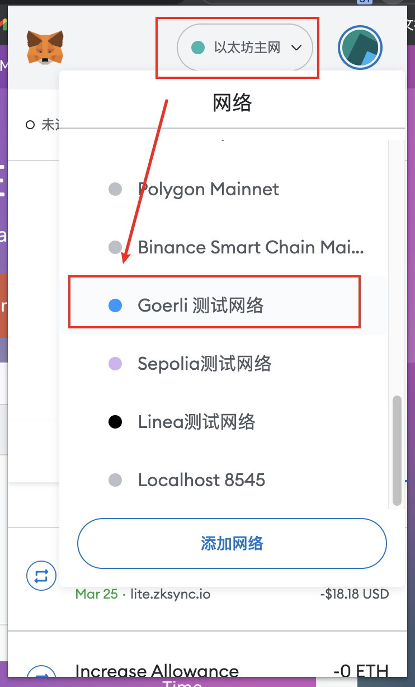
然后打开[alchemy 水龙头](https://goerlifaucet.com/)领取 Goerli 测试币。
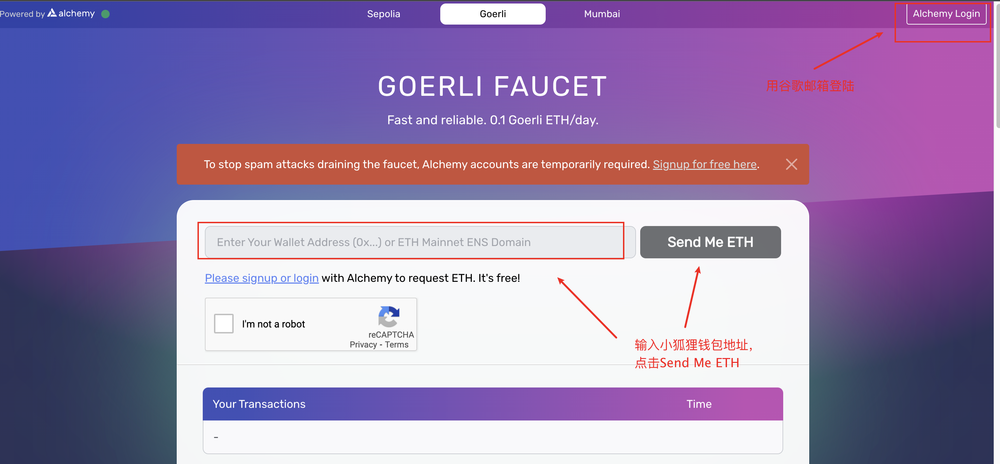
看到钱包里有 GoerliETH 就代表成功了。
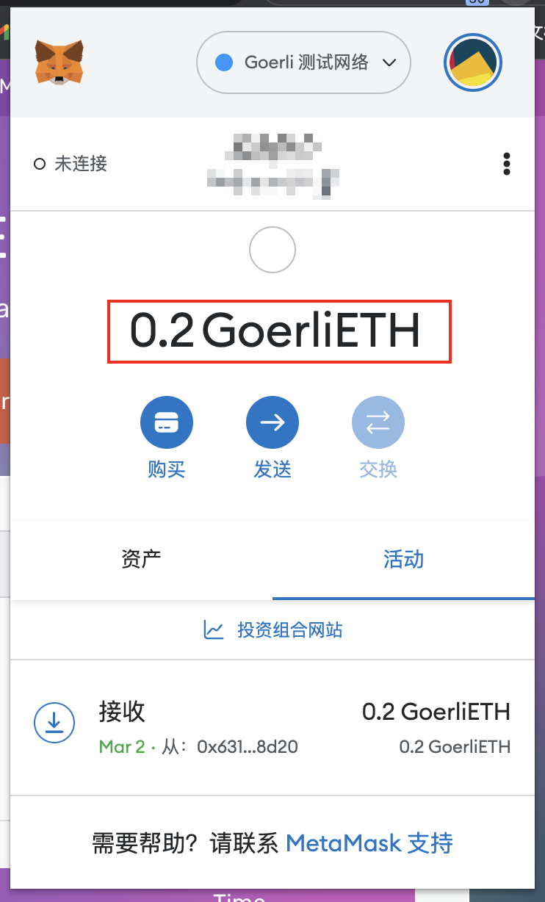

### 打开 Remix

[Remix](https://remix.ethereum.org/)是我编写智能合约需要使用到的。

### 打开 Goerli Etherscan

[Goerli Etherscan](https://goerli.etherscan.io/) 可以查看我们稍后要的部署合约，转账等链上交互信息。
准备工作完成后，我们就可以开始编写智能合约了。

## 编写 ERC20 Token 智能合约

在 Remix 里创建一个名为 mytoken.sol 的文件
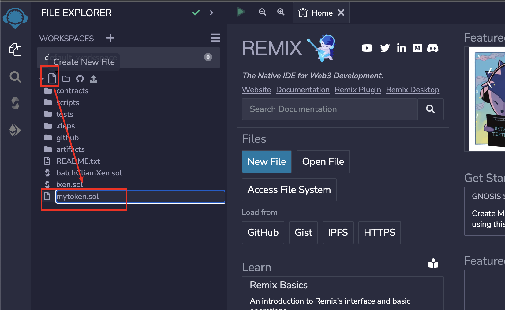
编写以下代码

- 创建名称为 MyToken，代号为 MT 的代币。
- 自定义发行量，并且合约创建者获得所有代币。

```solidity
// SPDX-License-Identifier: MIT
// 声明合约所使用的许可证类型为MIT
pragma solidity ^0.8.0;

// 引入OpenZeppelin中的ERC20标准合约
import "https://github.com/OpenZeppelin/openzeppelin-contracts/blob/master/contracts/token/ERC20/ERC20.sol";

// 声明合约，继承ERC20合约
contract MyToken is ERC20 {

    // 构造函数,初始化代币名称:MyToken 代号:MT
    // 传入参数initialSupply,是代币的发行量
    constructor(uint256 initialSupply) ERC20("MyToken", "MT") {
        // 合约的创建者获得所有的代币
        _mint(msg.sender, initialSupply);
    }
}

```

简单的几行代码，我们就完成了一个 ERC20 Token 智能合约的编写。下面让我们一起部署到以太坊 Goerli 测试网上吧。

## 部署智能合约，发行 ERC20 Token

编写好智能合约后，在链上发行代币变得非常简单。

- 我们发行属于自己的第一个代币。
- `mint 1000`枚代币给自己。

在`Remix`上编译好`MyToken`合约
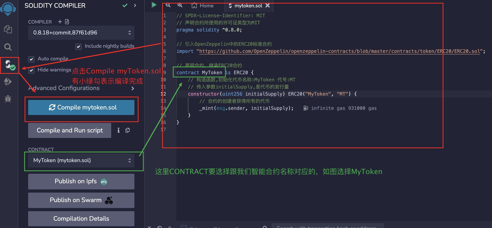
切换到部署栏，选择 Injected Provider - MetaMask。用 `MetaMask` 进行部署操作
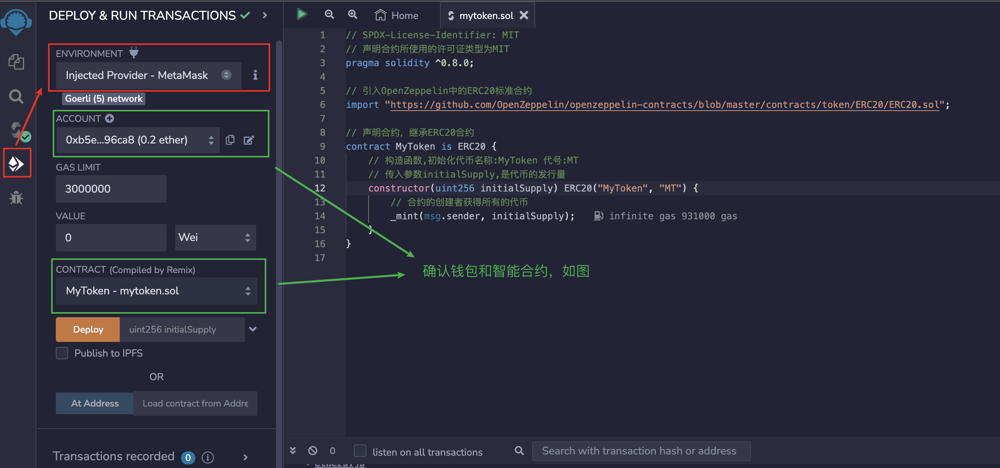
在部署栏输入构造函数的参数，`initialSupply`设为`1000000000000000000000`，然后点击`deploy`键进行部署。
注意：solidity 的单位有 `wei,gwei,ether`。并且 solidity 是没有小数的，solidity 代码里的运算我们需要用 `wei` 单位，这里我们希望 mint 1000 枚代币，相当于 1000 `ether`。所以我们需要把 `ether` 转化为 `wei` 单位，对应的就是 1000000000000000000000。[solidity 单位转换工具](https://eth-converter.com/)
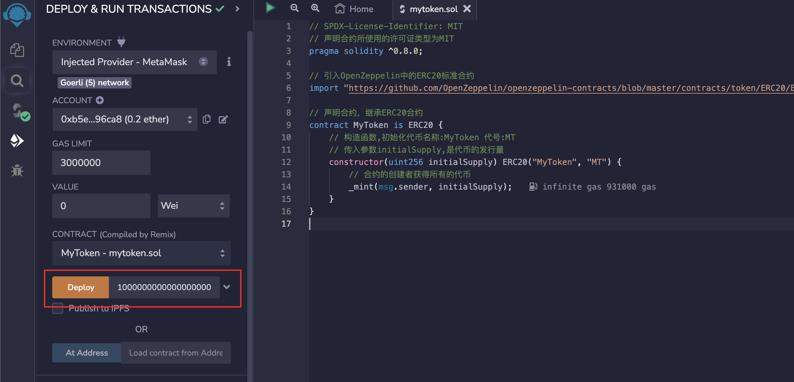
弹出 `MetaMask` 后，确认区块网络是否为 Goerli 网络，然后点击确定
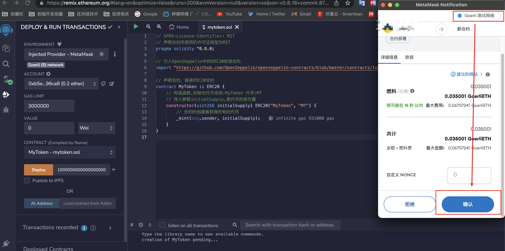
部署成功之后，我们可以查看智能合约的地址和里面的函数方法
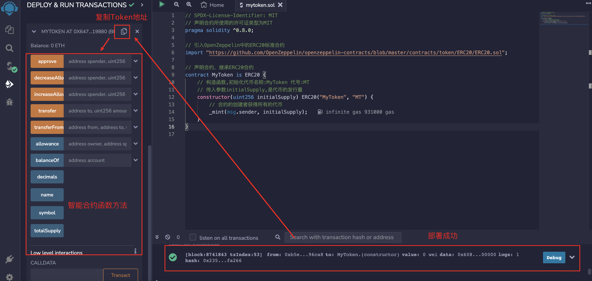

这样，我们就创建好了`MT`代币。并且已经拥有了 1000 枚`MT`代币。

## 尝试 Token 转账，查看链上信息

现在我们拥有了自己的代币，我们尝试把代币转给别人。

- 查询自己的代币余额
- 把代币转给其他地址。
- 在`Etherscan`上查看链上信息。

首先我们在`Remix`中找到 `balanceOf` 方法，该方法可以帮我们查询某个钱包地址的代币余额，在这里我们输入刚刚部署这个合约的钱包地址，然后点击 call
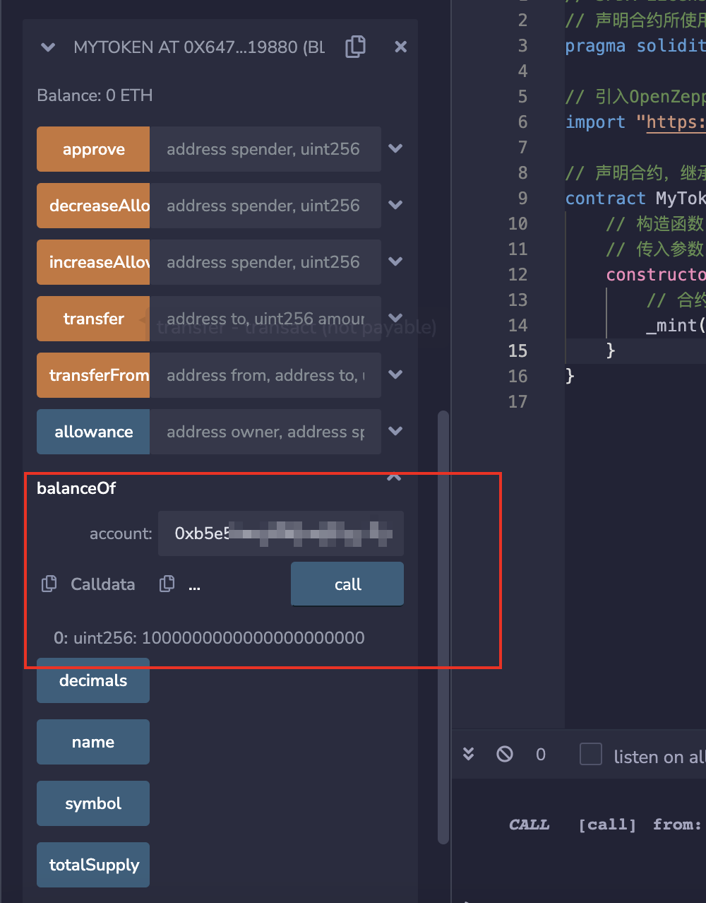
得到的结果是 1000000000000000000000，这里单位是 wei，我们把 wei 转换成 ether，结果就是 1000。所以我们这个钱包地址有 1000 枚代币。

然后找到 `transfer` 方法，该方法可以帮我们把代币转账给别的地址。这里我们 to 输入另外一个钱包地址，amount 输入 99000000000000000000，意思是向另外一个地址转账 99 枚代币。输入好之后，点击 transfer，MetaMask 弹出选择确定。
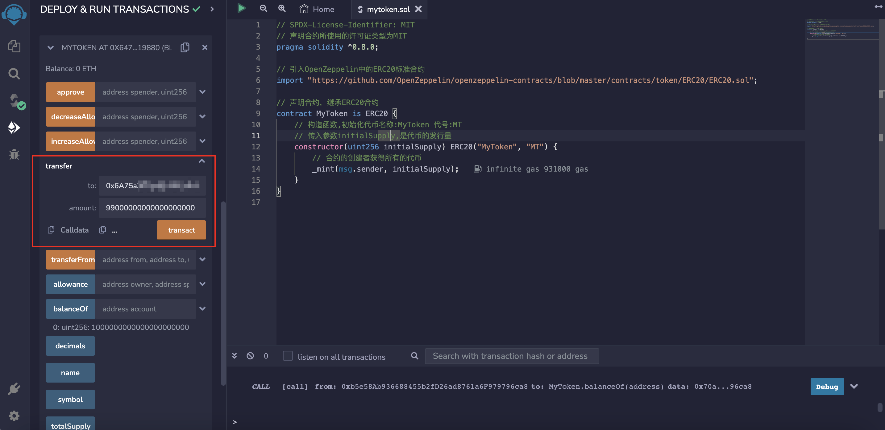
成功之后，跟刚刚一样调用`balanceOf` 方法，查看代币是否转移。

最后我们在`Etherscan`上查看链上信息。
打开[Goerli 区块链浏览器](https://goerli.etherscan.io/)，在搜索框输入部署合约的地址后点搜索。就可以看到地址的余额，链上交互信息等。
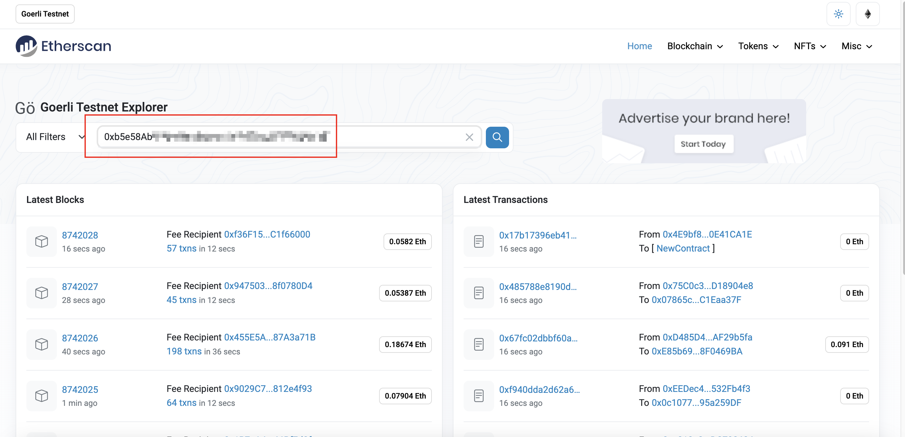
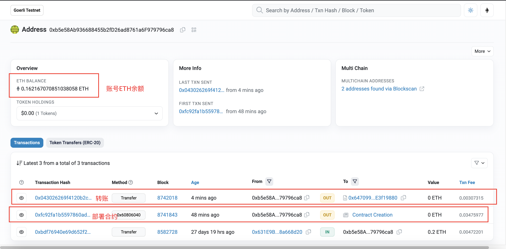

## 总结

这这一讲里，我学习了 OpenZeppelin,Remix，并在以太坊测试网上发布了属于自己的 ERC20 Token。mint 了属于自己的代币并发送给其他人。还学习了如何使用 MetaMask 在链上进行交互和怎么使用 Etherscan 来查看链上交互信息。感谢大家的阅读。祝大家在学习路上越来越牛。
